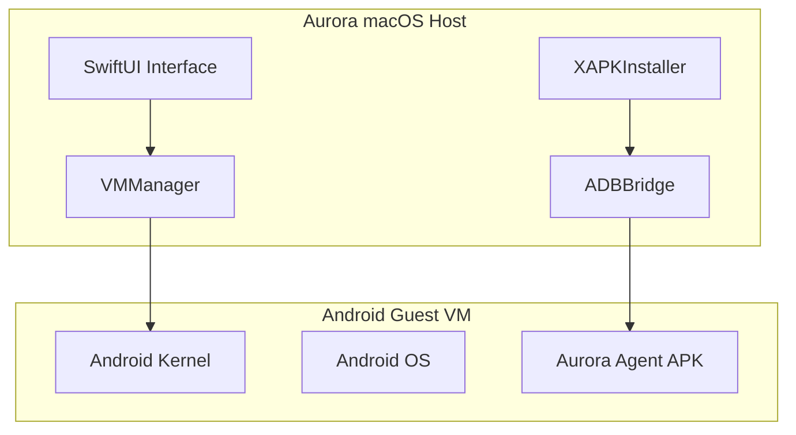

# Aurora Android XAPK Player

> **Professional Android virtualization platform for macOS** - Run Android APKs and XAPKs natively on Apple Silicon and Intel Macs using Apple's Virtualization Framework.

[](https://swift.org)
[](https://developer.apple.com/macos/)
[](https://developer.apple.com/documentation/virtualization)
[](LICENSE)

## 🚀 Features

### ✅ **Advanced Development** (55% Complete)

- **🖥️ Native macOS Interface** - SwiftUI-based sidebar with library management and real-time progress
- **🔧 Apple Virtualization Framework** - Professional VM management with conditional compilation support
- **📱 XAPK/APK Installation** - Complete parser supporting split APKs, OBB files, and manifest validation
- **🌉 ADB Communication Bridge** - Full ADB command execution, device management, and auto-detection
- **🎮 Aurora Android Agent** - Native input injection via accessibility service and TCP communication
- **⚡ Metal-Accelerated Display** - 60fps GPU rendering with boot/running state overlays
- **📊 Real-Time Progress Tracking** - Live installation progress with detailed phase information

### 🚧 **In Development**

- **🎯 Input Mapping Profiles** - Keyboard/mouse to touch translation with JSON configuration
- **📈 Performance Optimization** - Resource management and thermal control
- **🐛 Debugging Tools** - HUD diagnostics and VM introspection

## 🏗️ Architecture



## 🛠️ Technology Stack

- **Frontend**: SwiftUI + SwiftData for native macOS experience
- **Virtualization**: Apple Virtualization Framework (AVF) with QEMU fallback
- **Rendering**: Metal/MetalKit for high-performance GPU-accelerated display
- **Communication**: ADB (Android Debug Bridge) + Custom TCP protocol
- **Android Agent**: Kotlin with Accessibility Service and TCP server
- **Package Management**: Custom XAPK/APK parser with ZIP extraction

## 📋 Prerequisites

### Development
- **macOS 14.6+** (Sonoma or later)
- **Xcode 15.4+** with Swift 5.0
- **Apple Developer Account** (for Virtualization entitlements)

### Runtime
- **Apple Silicon or Intel Mac** with virtualization support
- **8GB+ RAM** recommended (4GB minimum)
- **20GB+ free storage** for Android images and installed apps
- **ADB** (automatically detected or installable via Homebrew)

## 🚀 Quick Start

### 1. Clone and Build

```bash
git clone git@github.com:Progress-Harold/APKSplicer.git
cd APKSplicer
open APKSplicer.xcodeproj
```

### 2. Setup Android Images

```bash
# Download and configure Android kernel
./Scripts/setup-android-images.sh

# Or run individual steps
./Scripts/setup-android-images.sh download
./Scripts/setup-android-images.sh extract
```

### 3. Enable Virtualization (Production)

For real Android VM functionality, you'll need:

1. **Apple Developer Account** with Virtualization entitlements
2. Enable entitlements in `APKSplicer.entitlements`:
   ```xml
   <key>com.apple.vm.networking</key>
   <true/>
   <key>com.apple.vm.device-access</key>
   <true/>
   ```

### 4. Install Aurora Android Agent

Build and install the Aurora Agent APK on your Android VM:

```bash
cd AndroidAgent
./gradlew assembleDebug
adb install app/build/outputs/apk/debug/app-debug.apk
```

## 📱 Usage

### Installing Apps

1. **Drag & Drop** - Drop XAPK or APK files directly into Aurora
2. **File Import** - Use the import button to browse and select files
3. **Progress Tracking** - Monitor real-time installation progress

### VM Management

- **Launch** - Start Android VM with selected performance profile
- **Stop** - Gracefully shutdown the virtual machine
- **Reset** - Restore VM to clean state

### ADB Integration

Aurora automatically detects and manages ADB connections:

- **Auto-detection** - Finds ADB in standard installation paths
- **Connection Status** - Real-time status indicators in the UI
- **Command Execution** - Full shell access and file transfer

## 🎮 Performance Profiles

Aurora includes optimized performance profiles:

| Profile | CPU Cores | RAM | Storage | Display | Use Case |
|---------|-----------|-----|---------|---------|----------|
| **Low** | 2 | 3GB | 8GB | 720p | Light apps, testing |
| **Medium** | 4 | 6GB | 16GB | 1080p | Most apps, gaming |
| **High** | 8 | 12GB | 32GB | 1440p | Heavy apps, development |

## 🔧 Development

### Project Structure

```
APKSplicer/
├── APKSplicer/                 # Main macOS app
│   ├── Core/                   # Business logic
│   │   ├── VMManager.swift     # Virtualization management
│   │   ├── ADBBridge.swift     # ADB communication
│   │   ├── XAPKInstaller.swift # Package installation
│   │   └── Models.swift        # Data models
│   ├── UI/                     # SwiftUI interface
│   └── Docs/                   # Documentation
├── AndroidAgent/               # Android agent APK
│   ├── src/main/kotlin/        # Kotlin source
│   └── build.gradle.kts        # Android build config
├── Scripts/                    # Automation scripts
└── Images/                     # Android kernels and disks
```

### Building for Development

Aurora supports development without Virtualization entitlements:

```bash
# Build with mock VM (no entitlements required)
xcodebuild -project APKSplicer.xcodeproj -scheme APKSplicer build

# Test UI and installation pipeline
open build/APKSplicer.app
```

### Contributing

1. **Fork** the repository
2. **Create** a feature branch (`git checkout -b feature/amazing-feature`)
3. **Commit** your changes (`git commit -m 'Add amazing feature'`)
4. **Push** to the branch (`git push origin feature/amazing-feature`)
5. **Open** a Pull Request

## 📋 Roadmap

### Phase C - Performance & Profiles (Weeks 4-6)
- [ ] Advanced performance monitoring
- [ ] Custom resolution and DPI scaling
- [ ] Thermal management and power profiles

### Phase D - Input & Gaming (Weeks 6-8)
- [ ] Keyboard/mouse input mapping
- [ ] Game controller support
- [ ] Custom input profiles per app

### Phase E - Polish & Distribution (Weeks 8-10)
- [ ] App Store preparation
- [ ] Documentation and tutorials
- [ ] Performance optimization

## 🐛 Troubleshooting

### Common Issues

**VM Won't Start**
- Ensure Virtualization entitlements are enabled
- Check Apple Developer account provisioning
- Verify Android kernel path in configuration

**ADB Connection Failed**
- Install ADB via Homebrew: `brew install android-platform-tools`
- Check VM network connectivity
- Restart Aurora and try reconnecting

**Installation Failures**
- Verify XAPK file integrity
- Check available storage space
- Review installation logs in Aurora

### Getting Help

- **Issues**: [GitHub Issues](https://github.com/Progress-Harold/APKSplicer/issues)
- **Discussions**: [GitHub Discussions](https://github.com/Progress-Harold/APKSplicer/discussions)
- **Documentation**: [Project Wiki](https://github.com/Progress-Harold/APKSplicer/wiki)

## 📄 License

This project is licensed under the MIT License - see the [LICENSE](LICENSE) file for details.

## 🙏 Acknowledgments

- **Apple** for the powerful Virtualization Framework
- **Android Open Source Project** for Android-x86 and GSI
- **Swift Community** for excellent tooling and libraries

## 📊 Project Status

**Overall Progress: 55%** - Advanced beyond Phase B goals

- **Current Phase**: Phase B — Install & Play
- **Next Milestone**: Input mapping and real Android VM testing
- **Target MVP**: 2025-03-15 (7 weeks from start)

- ✅ **VM Architecture** - Production-ready Apple Virtualization Framework integration
- ✅ **ADB Communication** - Complete host-guest communication bridge
- ✅ **Installation Pipeline** - Full XAPK/APK parser and installer
- ✅ **Android Agent** - Native input injection system
- ✅ **macOS Interface** - Professional SwiftUI application

**Next Milestone**: Input mapping and real Android VM testing

---


## 🎯 Recent Achievements

- 1. [x] **AUR‑A‑001** App scaffold — ✅ 2025-01-27
- 2. [x] **AUR‑B‑001** VM spec structs — ✅ 2025-01-27 (VMManager, PerformanceProfile, VMConfiguration)
- 3. [x] **AUR‑B‑002** AVF boot (hello world frame) — ✅ 2025-01-27 (ready for real Android kernel)
- 4. [x] **AUR‑B‑005** ADB port‑forward; reachability check — ✅ 2025-01-27 (full ADB bridge + agent)
- 5. [x] **AUR‑A‑005** Drag‑drop handler → install flow stub — ✅ 2025-01-27 (file import + progress tracking)

*Last updated: 2025-08-27 18:55*
